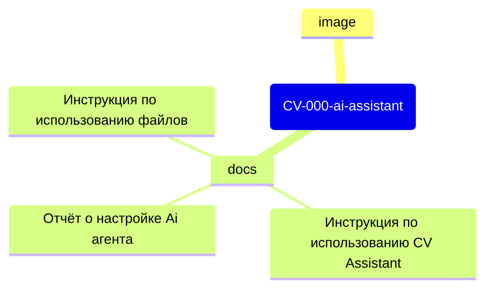

# CV-000-ai-assistant

## 1. Общая информация

- **Название проекта**: Кодовое название CV-000-ai-assistant он же - «Автономный ассистент 2025 для CV‑разработки на Python (аналог Cursor AI без санкционных зависимостей)»

- **Тип проекта**: open‑source ПО для автоматизации кодирования

- **Версия**: MVP 1.0

- **Лицензия**: MIT

- **Целевая аудитория**: рекрутеры, разработчики CV‑систем, исследователи, инженеры ML/CV

- **Платформа**: локальная установка (Windows/Linux/macOS)

- **Основной язык интерфейса**: русский (с опцией переключения на английский)
  
  ## 2. Цель проекта

Создать полностью автономный инструмент для помощи в написании кода на Python для задач технического (компьютерного) зрения, лишённый зависимости от санкционных сервисов и обеспечивающий:

- удовлетворительную скорость работы;

- специализацию на CV‑библиотеках;

- простоту интеграции с рабочей средой разработчика.

## 3. Ключевые показатели успеха (OKR-KPI)

**Качественные показатели (КАП):**

1. **Ресурсоёмкость** — приоритет готовым решениям и повторному использованию кода.

2. **Бесплатность** — отсутствие платных API, полная оффлайн‑работа.

3. **MVP‑подход** — фокус на базовом функционале без «улучшайзеров».

4. **Скорость ответов** — до 5–10 секунд на предложение (~100 символов).

5. **Специализация** — глубокая интеграция с OpenCV, YOLO, PyTorch.

6. **Интеграция с VS Code** — стабильная работа как расширения.

7. **Автономность** — работа без постоянного интернет‑соединения.

8. **Учёт аппаратных возможностей** — оптимизация под конфигурацию Dell Precision 7920 Tower Workstation.

9. **Локализация** — русский язык интерфейса (с опцией английского).

10. **Интеграция с проектом** — полный доступ к файловой структуре проекта.

11. **Простота настройки** — автоматизированная инсталляция, отсутствие «слётов».

12. **Отсутствие географических ограничений** — доступность из России без ограничений.

13. **Контекстная память** — сохранение истории взаимодействий и долгосрочных целей пользователя.

14. **Масштабируемость** — возможность расширения функционала под личные/бытовые задачи.

**Количественные показатели (КОП):**

- время отклика: ≤ 10 сек;

- поддерживаемые IDE: VS Code (версия ≥ 1.70);

- совместимость с Python: 3.8–3.14;

## 4. Технические требования

**Аппаратная конфигурация (целевой стенд):**

- CPU: 2× Xeon;

- RAM: 128 ГБ;

- GPU: Quadro RTX 4000 (8 ГБ VRAM);

- ОС: Windows 10 Pro/Linux (Ubuntu 22.04+)/macOS 12+.

**Программные зависимости (open‑source):**

- Python 3.8+;

- OpenCV;

- NumPy;

- SciPy;

- Tkinter (для GUI);

- VS Code Extension API.

## 5. Этапы реализации

**Этап 1. Подготовка**

- анализ готовых решений, аналогов, примеров (Cursor AI, GitHub Copilot, Continue.dev: GPT-3.5 (OpenAI), Claude Haiku (Anthropic), Codeium, Tabnine, Replit, Amazon CodeWhisperer; DeepSeek Coder,  Qwen Coder, Yandex Cloud AI Studio в Visual Studio Code с использованием SourceCraft Code Assistant, Тест продуктов от АО «Сбербанк-Технологии»)

**Этап 2. Настройка и доработка**

- настройка под целевую аппаратную конфигурацию;

- тестирование производительности;

- оптимизация скорости работы в случае необходимости.

**Этап 3. MVP**

- достижение ключевых показателей;

- документирование.

## 7. Критерии приёмки MVP

- все КАП и КОП достигнуты;

- отсутствие критических ошибок в работе после плановой и аварийной перезагрузки открытого проекта;

## 8. Риски и меры их минимизации

| Риск                           | Меры минимизации                               |
| ------------------------------ | ---------------------------------------------- |
| Низкая скорость работы         | оптимизация алгоритмов, кэширование            |
| Конфликты зависимостей         | виртуальные окружения, строгий контроль версий |
| Сложность интеграции с VS Code | поэтапная разработка плагина                   |
| Недостаточная база шаблонов    | привлечение сообщества к наполнению            |
| Отключение электричества       | Покупка ИБП                                    |

## 9. Структура проекта

