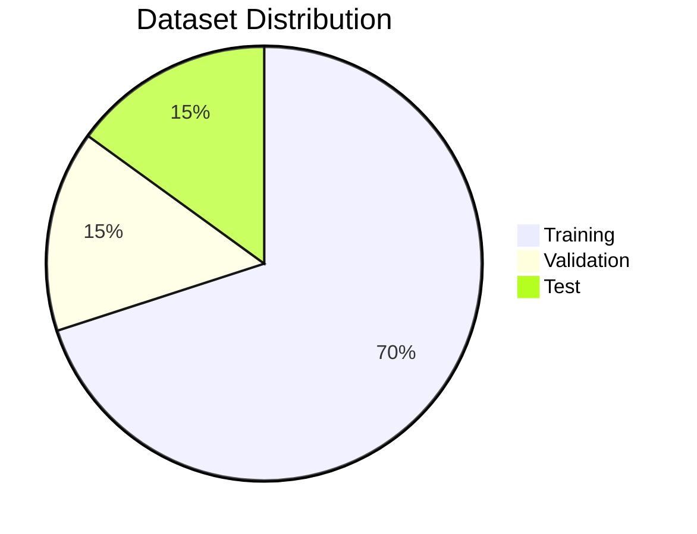
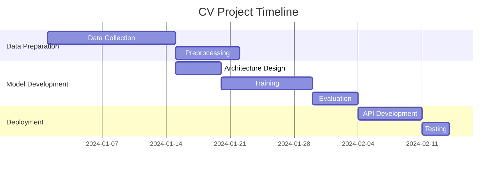
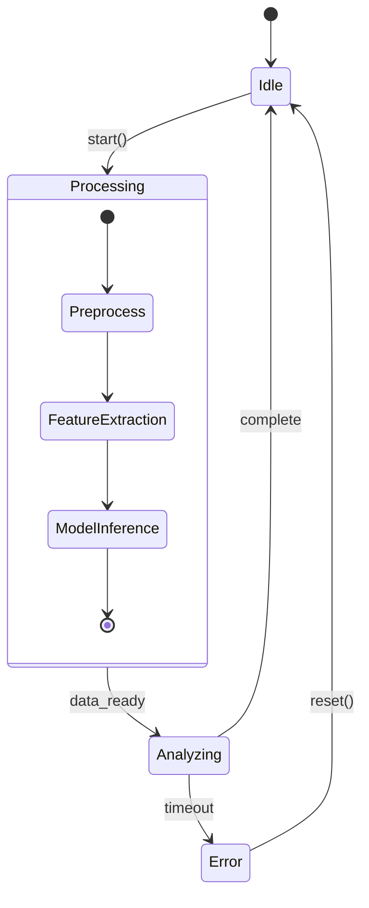
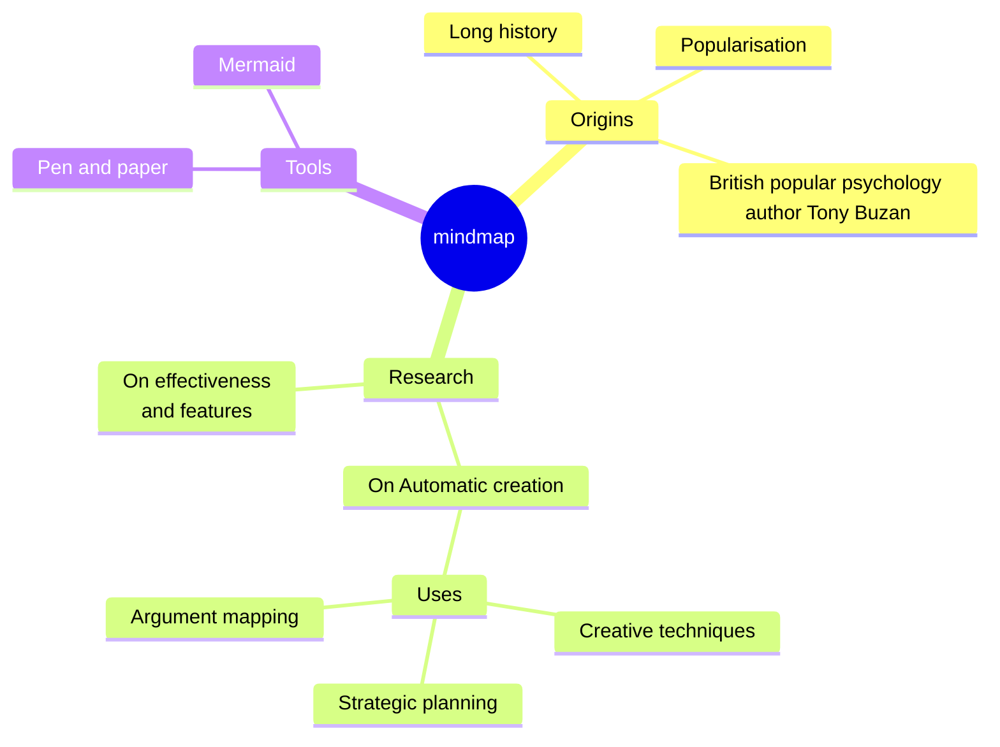
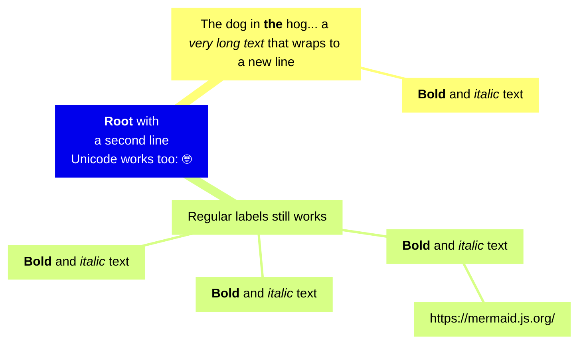
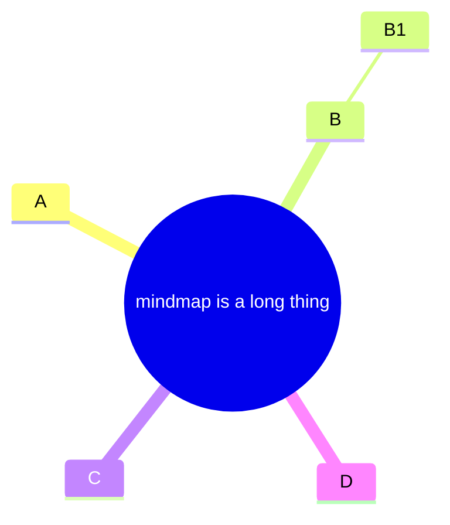
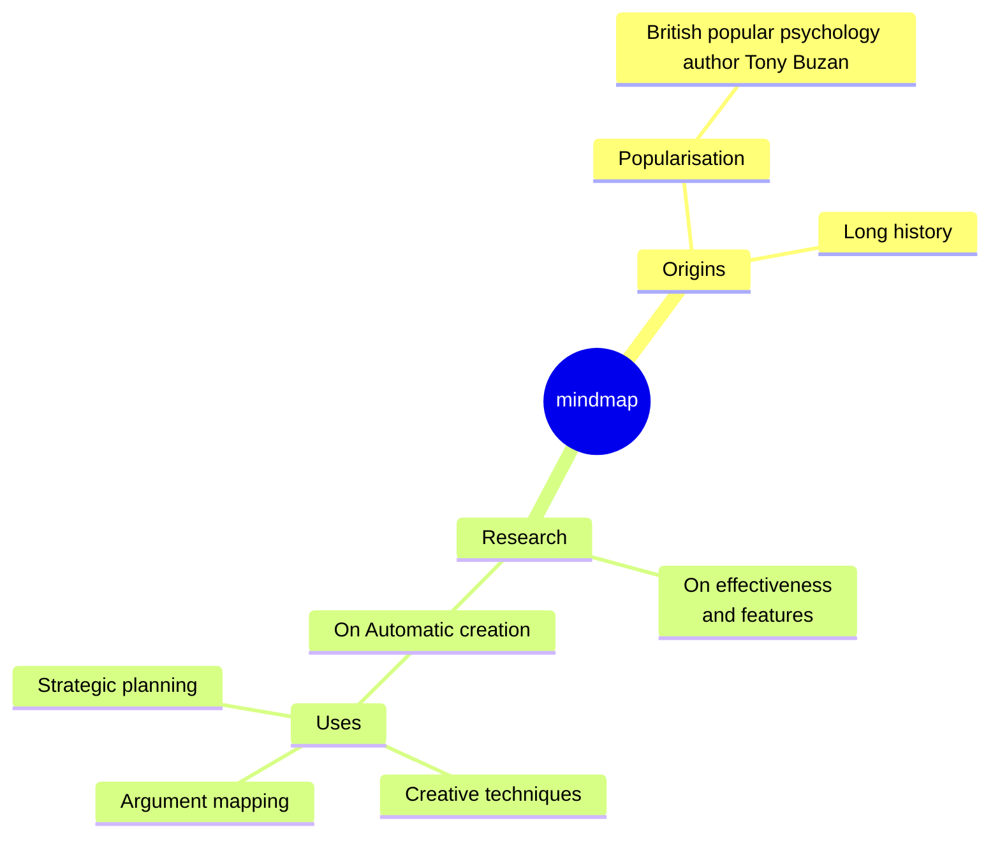

# 📈 Mermaid Chart Plugin Test

## Pie Chart
Code:

## Gantt Chart
Code:

## State Diagram
Code:

## Mindmap

- Mindmap | Mermaid: https://mermaid.js.org/syntax/flowchart.html#mindmap

### An example of a mindmap.
Code:

### Markdown Strings
Функция "Markdown Strings" расширяет возможности интеллектуальных карт, предлагая более универсальный тип строк, который поддерживает такие параметры форматирования текста, как полужирный шрифт и курсив, и автоматически переносит текст в метки.

Code:

### Tidy-tree Layout (Аккуратный древовидный макет)
Структура tidy-tree упорядочивает узлы в иерархическом древовидном порядке. Она особенно полезна для диаграмм, где важны отношения «родитель-потомок», например, для интеллект-карт.

#### Features (Особенности)
Упорядочивает узлы в виде аккуратного, неперекрывающегося дерева
Идеально подходит для ментальных карт и иерархических данных
Автоматически регулирует интервалы для удобства чтения

#### Example Usage (Пример использования)

Code 1:

Code 2:

## Icons
Итсочник: https://fontawesome.ru/all-icons/

## Feedback
- Круто! Красиво. Всё работает исправно
- [Mermaid Live Editor](https://mermaid.live/edit#pako:eNpdkk9vnDAQxb_KyKddiW4DLLsBVZWS9NgoUZtcKi4ODGAVZujYjkpW-93r_UOShouZ33vzPLJmpyquURVqMFQPeiwJQJjdYnEGy-UBAdyJaQ3ZUwHwnamFzljHMs2sKEzFtGg0NPrTE_Pv5azc8-h7LcZqZ5hmCnAtxhnbwXjSYbRT1XHP7QTau44FHpgmuPYv-tz1Ay1qqbo5444AmwYrZ56R0NovT_L5q6YaGtTOC9p3xivveAgTVFAJfpjk0b5ZT9_N0fOM4LDqyPzxHw0_nWiHbYgbe01kqP1fv5LWD0gOwiuOr-oDc_8u6B4JDuOOekR5w7cogza1ilQr4SiceIzUcKaF2h2spXIdDliqIvzW2Gjfu1KVtA9to6ZfzMPcKezbThWN7m2o_FiHyb8Z3YoeXqkg1Sg37MmpIj5GqGKn_oYiTleb7WWex1mSbuNsk0VqCnidrpJ0vU2yNI0v8jTb7CP1crz1YrXJA8zjdRJvs8skXkcKaxO25fa0bset2_8DFgrEnQ)
- Официальная документация Mermaid ChartE
  - 1: https://plugins.jetbrains.com/vendor/mermaid-chart
  - 2: https://mermaid.js.org/
