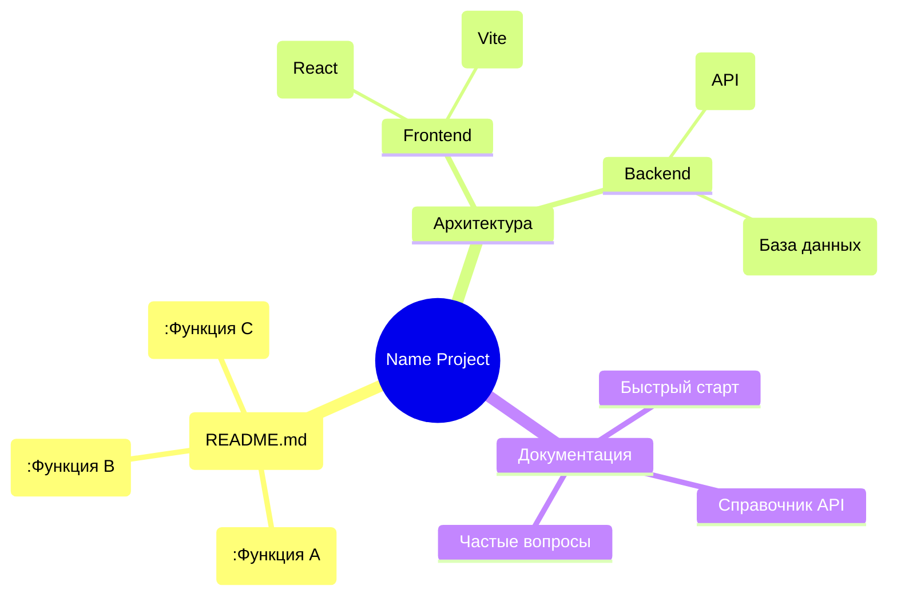

# Название проекта
1. Название проекта: ^[Название проекта]
2. Код проекта: ^[CV-9999]

## Краткое описание
Опишите кратко, что это за проект и какую задачу решает.

## Цели проекта
- Цель 1
- Цель 2
- Цель 3

## Технологии и инструменты
- Технология 1
- Технология 2
- Инструмент 3

## Требования к системе
- Операционная система: ^[Windows; Linux; MacOS]
- Версия языка программирования: ^[Python; C++]
- Другие зависимости

## Установка
1. Шаг 1
2. Шаг 2
3. Шаг 3

## Запуск
Опишите, как запустить проект.

## Использование
Опишите, как использовать проект, какие функции доступны.

## Примеры
Приведите примеры использования.

## Тестирование
Опишите, как тестировать проект.

## Проблемы и ограничения
Опишите известные проблемы и ограничения.

## Планы на будущее
Что планируется добавить или улучшить.

## Структура проекта

## Лицензия
[MIT License](#D:\Apps\GitHub\KSP-Hub\My-CV-Engineering-Projects\LICENSE)

## ТЕКУЩИЕ ЗАДАЧИ @ИИ:
- [ ] [вставить конкретную задачу проекта, например, разработать архитектуру системы для распознавания объектов на изображениях, создать прототип модели для анализа видеопотоков, разработать алгоритм для сегментации изображений].
- [ ] []

<!--
### АРХИВ ЗАДАЧ @ИИ:

-->
## ТЕКУЩИЕ ЗАДАЧИ @ПОЛЬЗОВАТЕЛЯ:
- [ ] [вставить конкретную задачу проекта, например, разработать архитектуру системы для распознавания объектов на изображениях, создать прототип модели для анализа видеопотоков, разработать алгоритм для сегментации изображений]
- [ ] []

<!--
### АРХИВ ЗАДАЧ @ПОЛЬЗОВАТЕЛЯ:

-->