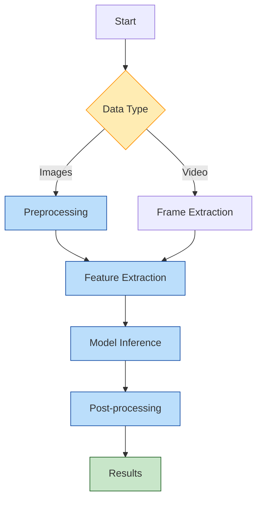
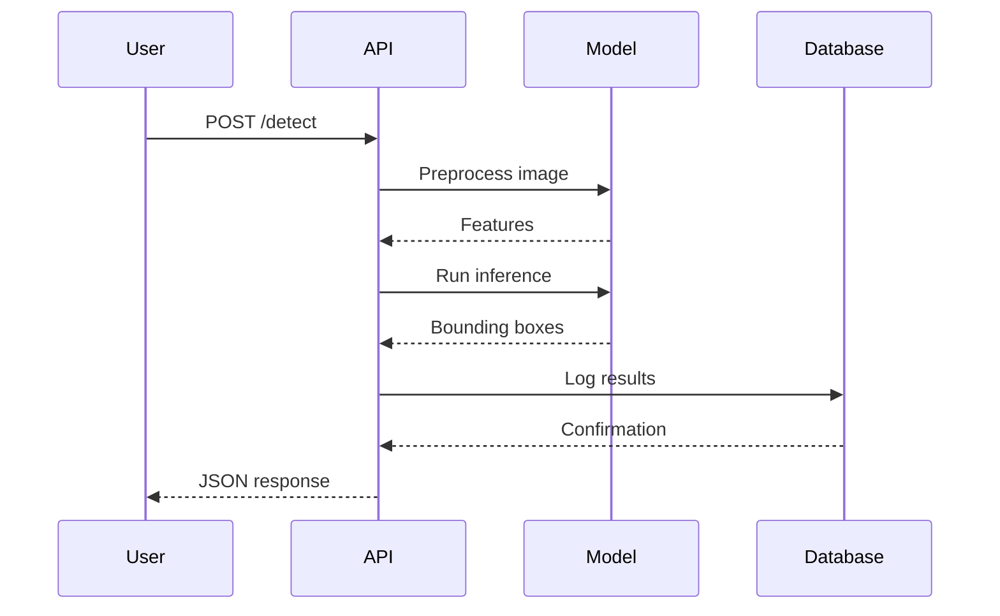
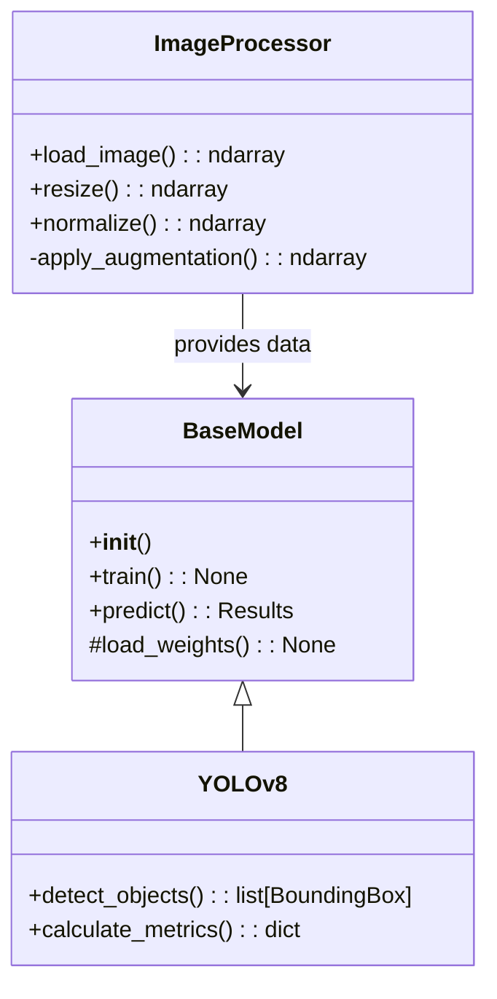

# 📊 Mermaid JetBrains Plugin Test

## Flowchart (Graph)

## Sequence Diagram

## Class Diagram

## Feedback
- Официальная документация plugin Mermaid JetBrains: https://plugins.jetbrains.com/plugin/20146-mermaid