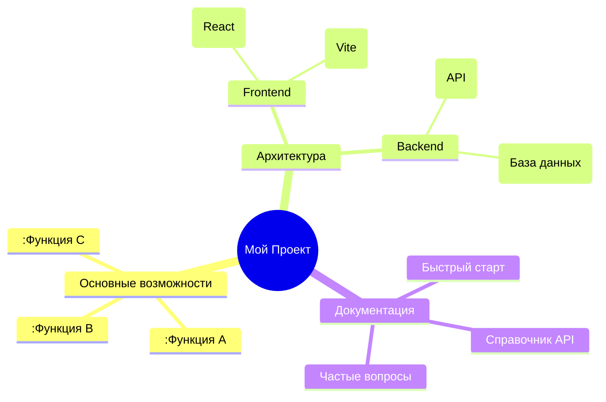

# Mermaid



# Markmap

```markmap
mindmap
  root((Мой Проект))
    Основные возможности
      :Функция A
      :Функция B
      :Функция C
    Архитектура
      Frontend
        (React)
        (Vite)
      Backend
        (API)
        (База данных)
    Документация
      Быстрый старт
      Справочник API
      Частые вопросы
```

## heading 1

- item 1 <!-- markmap: foldAll -->
  - item 1.1
    - item 1.1.1
  - item 1.2
    - item 1.2.1
- item 2

## heading 2 <!-- markmap: fold -->

- item 3
  - item 3.1
- item 4
  - item 4.1